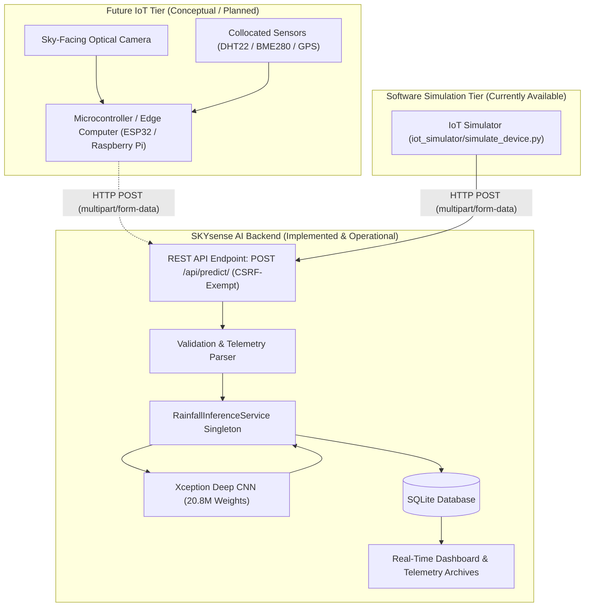
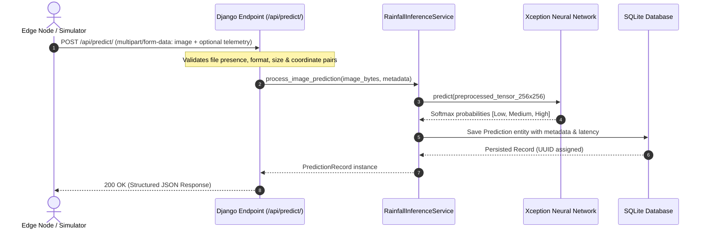

# SKYsense AI — Complete REST API Documentation

## 1. Architectural Scope & Hardware Disclaimer

> [!IMPORTANT]
> **HARDWARE STATUS DISCLAIMER:**  
> **Physical IoT hardware is NOT currently implemented or deployed.**  
> The `/api/predict/` endpoint and the accompanying `iot_simulator/` represent the **complete, production-ready software interface** designed to demonstrate how future IoT edge nodes, automated sky cameras, and microcontrollers (ESP32-CAM, Raspberry Pi, NVIDIA Jetson) will communicate with the SKYsense AI intelligence engine.
>
> All test payloads and sensor readings demonstrated in testing are **synthetic/simulated software values**. No physical sensor measurements are claimed.

---

## 2. System Architecture & Ingestion Flow

The following Mermaid diagrams illustrate the operational flow from future edge nodes to the AI model and persistence layer.

### 2.1 End-to-End IoT Integration Architecture



### 2.2 Sequence Diagram: Image Ingestion & Result Delivery



---

## 3. Endpoint Specification

### `POST /api/predict/`

Analyzes an uploaded sky photograph using the trained Xception deep learning model, estimates rainfall regime likelihood, and persists the observation along with optional telemetry.

- **URL:** `/api/predict/`
- **Method:** `POST`
- **Content-Type:** `multipart/form-data`
- **Authentication:** Unrestricted for automated IoT nodes (`@csrf_exempt`). 
  - Standard edge devices and headless scripts can submit predictions without session cookies or CSRF tokens.
  - If an active user session cookie is present, the record is automatically linked to the authenticated researcher account.
  - Forward-compatible with future header-based device authentication tokens (`X-Device-Token` / `Authorization: Bearer <token>`).

---

## 4. Request Parameters

The endpoint accepts parameters formatted as standard `multipart/form-data`:

### 4.1 Mandatory Parameters

| Parameter | Type | Ingestion Format | Constraints & Validation | Description |
|---|---|---|---|---|
| `image` | File (`binary`) | `multipart/form-data` | Formats: `.jpg`, `.jpeg`, `.png`<br>Max Size: **15 MB** | Sky-facing photograph of atmospheric cloud formations. |

### 4.2 Optional Future IoT Metadata Parameters

These parameters represent collocated edge telemetry. They are **entirely optional** and do not alter or interfere with normal web-upload functionality:

| Parameter | Type | Example | Validation & Value Range | Description |
|---|---|---|---|---|
| `device_id` | String | `RPI4-SKY-NODE-01` | Max 128 characters | Unique identifier of the edge camera hardware. Sets `source_type="IOT_DEVICE"`. |
| `latitude` | Float | `12.9716` | Range: `[-90.0, 90.0]` | GPS latitude in decimal degrees. *Must be accompanied by longitude.* |
| `longitude` | Float | `77.5946` | Range: `[-180.0, 180.0]` | GPS longitude in decimal degrees. *Must be accompanied by latitude.* |
| `temperature` | Float | `24.5` | Valid floating point number | Ambient ground temperature in &deg;C from collocated sensor. |
| `humidity` | Float | `78.2` | Range: `[0.0, 100.0]` | Ambient relative humidity percentage (%) from collocated sensor. |
| `notes` | String | `Edge capture` | Max 500 characters | Optional diagnostic, trigger, or field annotation notes. |

---

## 5. Response Schemas

### 5.1 Success Response (`200 OK`)

When the image is successfully validated, evaluated by the AI inference engine, and persisted to SQLite, the endpoint responds with HTTP `200 OK` and a structured JSON payload:

```json
{
    "success": true,
    "prediction": "Low_to_Medium_Rain",
    "confidence": 0.7642,
    "probabilities": {
        "Low_to_Medium_Rain": 0.7642,
        "Medium_to_Heavy_Rain": 0.1428,
        "No_to_Low_Rain": 0.0930
    },
    "timestamp": "2026-09-24T03:20:13.964371+00:00",
    "model_version": "Xception-v1.0",
    "id": "0a5bd8d2-5428-4eff-a847-9f5e25a9888b",
    "predicted_class": "Low_to_Medium_Rain",
    "processing_time_ms": 257.71,
    "source_type": "IOT_DEVICE",
    "device_id": "SIMULATED-JETSON-NANO-03",
    "latitude": 15.3173,
    "longitude": 75.7139,
    "temperature": 20.7,
    "humidity": 63.0
}
```

#### Field Specifications:

| Key | Type | Description |
|---|---|---|
| `success` | Boolean | `true` if processing succeeded; `false` otherwise. |
| `prediction` | String | Dominant predicted rainfall regime (`Low_to_Medium_Rain`, `Medium_to_Heavy_Rain`, or `No_to_Low_Rain`). |
| `confidence` | Float | Model certainty score between `0.0000` and `1.0000` for the dominant category. |
| `probabilities` | Object | Full Softmax distribution across all three calibrated classes (sums to ~1.0). |
| `timestamp` | String | ISO-8601 UTC timestamp of database ingestion. |
| `model_version` | String | Deployed deep learning model checkpoint release tag (`Xception-v1.0`). |
| `id` | String | Unique UUID primary key of the persistent database record. |
| `processing_time_ms` | Float | Dedicated AI inference execution time in milliseconds (excluding network transmission). |
| `source_type` | String | Ingestion provenance: `"IOT_DEVICE"` if `device_id` was supplied; otherwise `"API"`. |
| `device_id` | String / null | Echoed hardware identifier stored in the database. |
| `latitude` | Float / null | Echoed geographical latitude coordinate. |
| `longitude` | Float / null | Echoed geographical longitude coordinate. |
| `temperature` | Float / null | Echoed ambient ground temperature (&deg;C). |
| `humidity` | Float / null | Echoed ambient relative humidity (%). |

---

## 6. Error Handling & Status Codes

All errors return JSON payloads with `"success": false` and human-readable, actionable error messages. **Python tracebacks are never exposed to callers.**

### 6.1 `400 Bad Request` — Missing Image Parameter
Triggered when the mandatory `image` key is absent from the form-data payload:
```json
{
    "success": false,
    "error": "Missing required parameter: \"image\" must be provided in multipart/form-data."
}
```

### 6.2 `400 Bad Request` — Unsupported Image Format
Triggered when uploading non-image files or unsupported extensions:
```json
{
    "success": false,
    "error": "Unsupported file format. Please upload a valid JPG, JPEG, or PNG photograph."
}
```

### 6.3 `400 Bad Request` — Payload Exceeds Size Limit
Triggered when uploaded image exceeds the 15 MB payload ceiling:
```json
{
    "success": false,
    "error": "Image file size exceeds the 15 MB limit. Please select a smaller photograph."
}
```

### 6.4 `400 Bad Request` — Unpaired Geographical Coordinates
Triggered when latitude is provided without longitude (or vice versa):
```json
{
    "success": false,
    "error": "Both latitude and longitude must be provided together for geographical positioning."
}
```

### 6.5 `400 Bad Request` — Out-of-Bounds Sensor Reading
Triggered when sensor numbers deviate beyond physical validity (e.g. humidity > 100% or lat > 90°):
```json
{
    "success": false,
    "error": "Humidity must be a percentage between 0.0 and 100.0."
}
```

### 6.6 `405 Method Not Allowed` — Invalid HTTP Verb
Triggered if sending `GET`, `PUT`, `DELETE`, or `PATCH` to `/api/predict/`:
```json
{
    "detail": "Method \"GET\" not allowed."
}
```

### 6.7 `500 Internal Server Error` — Model / Backend Issue
Triggered if an unexpected internal exception occurs in the inference engine:
```json
{
    "success": false,
    "error": "AI inference service error occurred. Please try again."
}
```

---

## 7. Concrete Code Examples

### 7.1 cURL Request Examples

#### Minimal Upload (Image Only)
```bash
curl -X POST http://localhost:8000/api/predict/ \
  -F "image=@sky_sample.jpg"
```

#### Full IoT Ingestion (Image + Telemetry)
```bash
curl -X POST http://localhost:8000/api/predict/ \
  -F "image=@sky_sample.jpg" \
  -F "device_id=RPI4-SKY-NODE-01" \
  -F "latitude=12.9716" \
  -F "longitude=77.5946" \
  -F "temperature=25.4" \
  -F "humidity=76.8" \
  -F "notes=Routine 15-minute scheduled sky scan"
```

---

### 7.2 Python (`requests` Library on Edge Device)

```python
#!/usr/bin/env python3
import requests
import json

API_URL = "http://localhost:8000/api/predict/"
IMAGE_FILE = "cloud_specimen.jpg"

payload_metadata = {
    "device_id": "RPI4-SKY-NODE-01",
    "latitude": "12.9716",
    "longitude": "77.5946",
    "temperature": "24.8",
    "humidity": "72.5",
    "notes": "Automated Raspberry Pi edge capture"
}

try:
    with open(IMAGE_FILE, "rb") as img:
        files = {"image": (IMAGE_FILE, img, "image/jpeg")}
        response = requests.post(API_URL, files=files, data=payload_metadata, timeout=30)

    if response.status_code == 200:
        data = response.json()
        print("Inference Successful:")
        print(f"  Prediction : {data['prediction']}")
        print(f"  Confidence : {data['confidence'] * 100:.1f}%")
        print(f"  Latency    : {data['processing_time_ms']} ms")
        print("  Probabilities:")
        for category, prob in data["probabilities"].items():
            print(f"    - {category}: {prob * 100:.2f}%")
    else:
        print(f"Request failed with status {response.status_code}:")
        print(response.json())

except requests.exceptions.RequestException as e:
    print(f"Network error communicating with SKYsense API: {e}")
```

---

### 7.3 Conceptual MicroPython / ESP32-CAM Implementation

```python
# Conceptual MicroPython script for ESP32-CAM module
import urequests

def transmit_cloud_reading(image_bytes, device_id, temp_c, hum_pct):
    url = "http://192.168.1.100:8000/api/predict/"
    boundary = "----WebKitFormBoundary7MA4YWxkTrZu0gW"
    
    # Construct multipart/form-data payload manually
    body = (
        f"--{boundary}\r\n"
        f'Content-Disposition: form-data; name="device_id"\r\n\r\n{device_id}\r\n'
        f"--{boundary}\r\n"
        f'Content-Disposition: form-data; name="temperature"\r\n\r\n{temp_c}\r\n'
        f"--{boundary}\r\n"
        f'Content-Disposition: form-data; name="humidity"\r\n\r\n{hum_pct}\r\n'
        f"--{boundary}\r\n"
        f'Content-Disposition: form-data; name="image"; filename="cam.jpg"\r\n'
        f"Content-Type: image/jpeg\r\n\r\n"
    ).encode() + image_bytes + f"\r\n--{boundary}--\r\n".encode()

    headers = {"Content-Type": f"multipart/form-data; boundary={boundary}"}
    response = urequests.post(url, data=body, headers=headers)
    return response.json()
```

---

## 8. Testing with the Software Simulator

To test and demonstrate this API without physical hardware, use the provided software simulator:

```bash
# Test with a specific cloud image
python iot_simulator/simulate_device.py path/to/image.jpg

# Automated test using a verified specimen from the test dataset split
python iot_simulator/simulate_device.py --sample

# Test with custom simulated telemetry
python iot_simulator/simulate_device.py image.jpg \
  --device-id SIMULATED-ESP32-05 \
  --lat 12.9716 \
  --lon 77.5946 \
  --temp 26.5 \
  --humidity 75.0
```

The simulator prints the formatted JSON response, renders ASCII class probability distributions, and logs all transmissions to `iot_simulator/simulated_telemetry_log.json`.

---

## 9. Future IoT Integration Roadmap

1. **Phase 1 (Completed)**: REST endpoint `/api/predict/` with multipart ingestion, metadata persistence, and validation.
2. **Phase 2 (Completed)**: Simulated software edge client (`iot_simulator/simulate_device.py`) and automated test suite.
3. **Phase 3 (Future Work)**: Physical hardware prototyping:
   - Solar-powered outdoor enclosure with wide-angle upward-facing camera lens.
   - Microcontroller firmware (ESP32-CAM / Raspberry Pi Zero 2W).
   - Local queuing and offline caching if cellular/Wi-Fi connection drops.
   - Collocated environmental sensor integration (temperature, humidity, atmospheric pressure).
