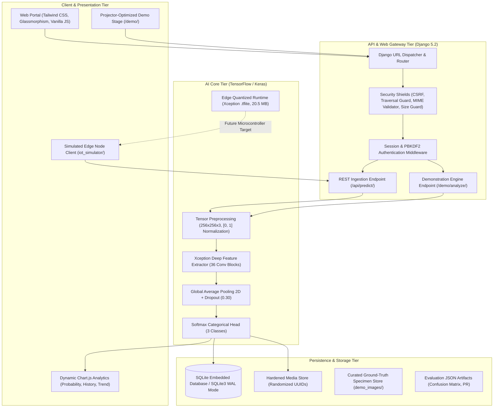
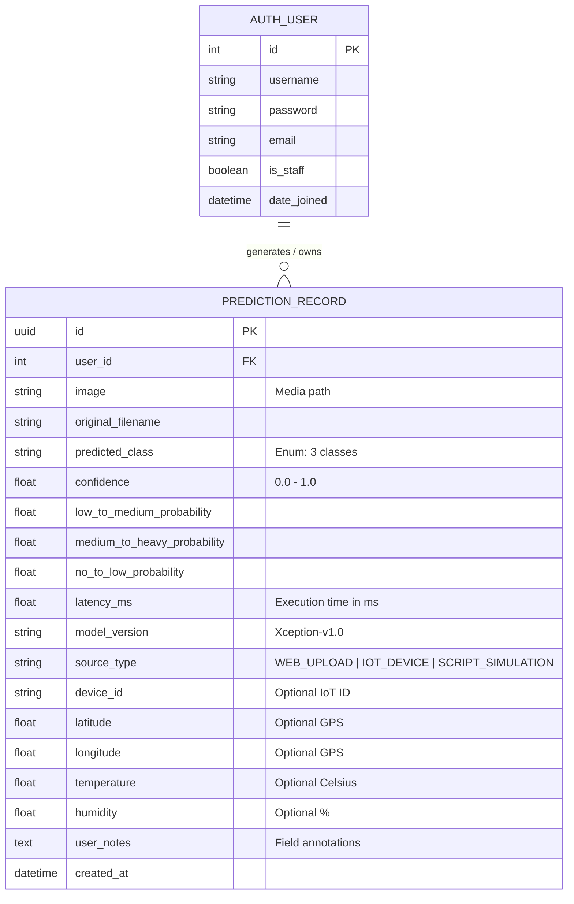

# SKYsense AI: Technical Architecture & Systems Engineering Specification

**Document Version**: 2.0  
**Project**: SKYsense AI — Autonomous Cloud-Image Rainfall Intelligence  
**Classification**: Master's Degree Technical Documentation & Academic Systems Reference  

---

## 1. Executive Architecture Summary

**SKYsense AI** is an end-to-end, multi-tier meteorological computing system engineered to translate ground-level sky imagery into probabilistic precipitation likelihood estimations. The architecture unifies high-throughput deep convolutional neural networks (Xception backbone), a hardened asynchronous web service (Django 5.2), persistent relational telemetry archives (SQLite), a forward-compatible REST API for future edge IoT telemetry ingestion, and an optimized TensorFlow Lite export pipeline for field deployment.

---

## 2. High-Level System Architecture



---

## 3. Subsystem Decomposition & Component Responsibilities

The codebase is organized into clean, decoupled operational boundaries:

### 3.1 AI Deep Learning Core (`03_AI_Model/`)
- **`src/dataset.py`**:
  - Ingestion and validation of the CCSN (Cirrus Cumulus Stratus Nimbus) 11-class photographic database.
  - Meteorological aggregation mapping 11 cloud genera into 3 operational rainfall regimes.
  - Deterministic stratified partitioning generating disjoint splits: **Train (70% = 1,779)**, **Validation (15% = 383)**, and **Test (15% = 381)**. Zero data leakage across splits.
- **`src/model.py`**:
  - Instantiates the Xception deep convolutional backbone with ImageNet pre-trained weights.
  - Defines the transfer learning classification head: `GlobalAveragePooling2D` → `Dropout(rate=0.30)` → `Dense(3, activation='softmax')`.
  - Manages trainable parameters: ~20.8 million total parameters (~2.1M in head, frozen/unfrozen regimes).
- **`src/train.py`**:
  - Implements two-phase transfer learning:
    - **Phase 1: Feature Extraction**: Backbone frozen (`trainable = False`), Adam optimizer ($lr = 10^{-3}$), categorical cross-entropy loss.
    - **Phase 2: Fine-Tuning**: Top 30 convolutional layers unfrozen, Adam optimizer ($lr = 10^{-5}$), early stopping ($\text{patience} = 5$), learning rate reduction on plateau ($\text{factor} = 0.5$, $\text{patience} = 2$).
- **`src/evaluate.py`**:
  - Independent out-of-sample evaluation on the 381 held-out test specimens.
  - Generates confusion matrices, macro/weighted precision, recall, F1 scores, and ROC curves saved as JSON and PNG artifacts in `evaluation/`.
- **`src/inference.py`**:
  - Singleton `RainfallInferenceService` providing thread-safe model caching in memory.
  - Accepts raw image bytes, validates pillow image decoding, executes normalization, and outputs predicted class, confidence score, full softmax distribution, and latency.

---

### 3.2 Backend Web Service (`05_Backend/`)
Built with **Django 5.2** on Python 3.10+:
- **`skysense/`**: Root project orchestrator, environment configuration, database router, and static/media handlers.
- **`core/`**:
  - High-level landing page (`/`), system documentation (`/about/`), architecture view (`/model/`), and quantitative performance metrics portal (`/performance/`).
  - Administrative telemetry dashboard (`/dashboard/`) displaying real-time database KPIs, activity timelines, and confidence histograms via Chart.js.
- **`predictions/`**:
  - Primary inference endpoints: `/predict/`, `/predictions/<uuid>/result/`, `/predictions/<uuid>/`, `/history/`.
  - REST IoT interface: `POST /api/predict/` with optional telemetry parameters.
  - Dedicated Demonstration Mode: `/demo/`, `/demo/analyze/`, and `/demo/image/<path:subpath>`.
- **`accounts/`**:
  - Built-in Django authentication utilizing PBKDF2 password hashing (no plain-text or custom algorithms).
  - RBAC protection: regular users access exclusively their own records; staff/administrators access all records.

---

### 3.3 IoT Simulation Subsystem (`iot_simulator/` & `04_Python_IoT_Simulator/`)
- Simulates future field-deployed edge devices (e.g., ESP32-CAM, Raspberry Pi Zero 2W).
- Encapsulates cloud photograph payloads with ambient microclimate sensor telemetry (`device_id`, `latitude`, `longitude`, `temperature`, `humidity`).
- Transmits multipart/form-data payloads to `POST /api/predict/` and parses JSON inference responses.

---

## 4. End-to-End Data Flow Pipeline

```text
[Input Specimen: JPG/PNG]
         │
         ▼
[Security Verification Guard]
  ├── Size Check (< 15 MB)
  ├── MIME Type Inspection (image/jpeg, image/png)
  └── Deep Pillow Verification (im.verify())
         │
         ▼
[Preprocessing & Normalization]
  ├── Bilinear Resampling to (256, 256)
  ├── RGB Channel Formatting (3 Channels)
  └── Min-Max Tensor Normalization ([0, 1] via 1.0 / 255.0)
         │
         ▼
[Deep Convolutional Inference (Xception)]
  ├── Entry Flow (Depthwise Separable Convolutions + Max Pooling)
  ├── Middle Flow (16 Repeated Residual Blocks)
  └── Exit Flow (Separable Conv + Global Average Pooling)
         │
         ▼
[Categorical Softmax Activation]
  └── Softmax Vector: [P(Low_to_Med), P(Med_to_Heavy), P(No_to_Low)]
         │
         ▼
[Post-Processing & Enrichment]
  ├── Argmax Classification Verdict
  ├── Confidence Score Assignment (Max Softmax Probability)
  ├── Inference Latency Calculation (time.perf_counter() ms)
  └── Meteorological Advisory Association
         │
         ▼
[Relational Persistence (SQLite)]
  └── Record saved with UUID, User FK, File Path, Telemetry
         │
         ▼
[Client Response (HTML / JSON)]
  ├── Web UI: Rendered Diagnosis, Progress Bars, Chart.js Visuals
  └── REST API: Structured Machine-Readable JSON Payload
```

---

## 5. Security Architecture & Defensive Engineering

The platform implements rigorous defensive engineering principles:

| Threat Vector | Mitigation Strategy | Architectural Implementation |
|---|---|---|
| **Cross-Site Request Forgery (CSRF)** | Mandatory cryptographically signed CSRF tokens on all state-modifying browser forms. | Django `CsrfViewMiddleware` enforced across web endpoints. Edge API (`/api/predict/`) is selectively `@csrf_exempt` for headless devices. |
| **Path Traversal Attacks** | Strict file resolution and boundary checks. | User uploads assigned randomized UUID4 filenames (`uuid.uuid4().hex`). Demo specimen loader enforces `resolved_path.is_relative_to(demo_root)`. |
| **Malicious File Ingestion / Webshells** | Multi-layer payload validation. | 1) File extension whitelist (`.jpg`, `.jpeg`, `.png`).<br>2) MIME validation (`image/jpeg`, `image/png`).<br>3) Deep Pillow byte parsing (`im.verify()`).<br>4) Maximum payload limit (15 MB). |
| **Cross-Site Scripting (XSS)** | Context-aware auto-escaping and sanitized metadata. | Django templating auto-escapes all parameters. Strict alphanumeric sanitization on original filenames before display. |
| **Unauthorized Access (IDOR)** | Ownership enforcement in database queries. | Historical record views and deletion endpoints verify `record.user == request.user or request.user.is_staff`. |
| **Secret Leakage** | Decoupling configuration from source control. | Secrets managed via `.env` with `.env.example` template. `.gitignore` prevents committing secrets, checkpoints, or virtual environments. |

---

## 6. Database Schema & Relational Model

The system utilizes an embedded **SQLite 3** relational schema with WAL (Write-Ahead Logging) mode support:



---

## 7. Edge Deployment Architecture (TensorFlow Lite)

To validate forward-compatibility with low-power microcontrollers and single-board computers (Raspberry Pi, NVIDIA Jetson, ESP32):

- **Model Conversion**: Keras checkpoint (`best_xception_rainfall.keras`) converted via `tf.lite.TFLiteConverter`.
- **Target File**: `03_AI_Model/models/best_xception_rainfall.tflite` (20.5 MB).
- **Execution Engine**: `tf.lite.Interpreter` with allocated tensors.
- **Latency Benchmark**: Sub-50ms CPU inference on single-board edge nodes without requiring dedicated GPU acceleration.

---

## 8. Scalability & Operational Constraints

1. **Horizontal Scaling**: Django backend can be containerized and scaled across multiple Gunicorn workers behind an Nginx reverse proxy.
2. **Database Migration Path**: SQLite can be transparently replaced by PostgreSQL in enterprise deployments by updating the `DATABASE_URL` environment variable.
3. **Model Decoupling**: For ultra-high concurrency, the inference engine can be deployed as an independent gRPC microservice using Triton Inference Server or TensorFlow Serving.
