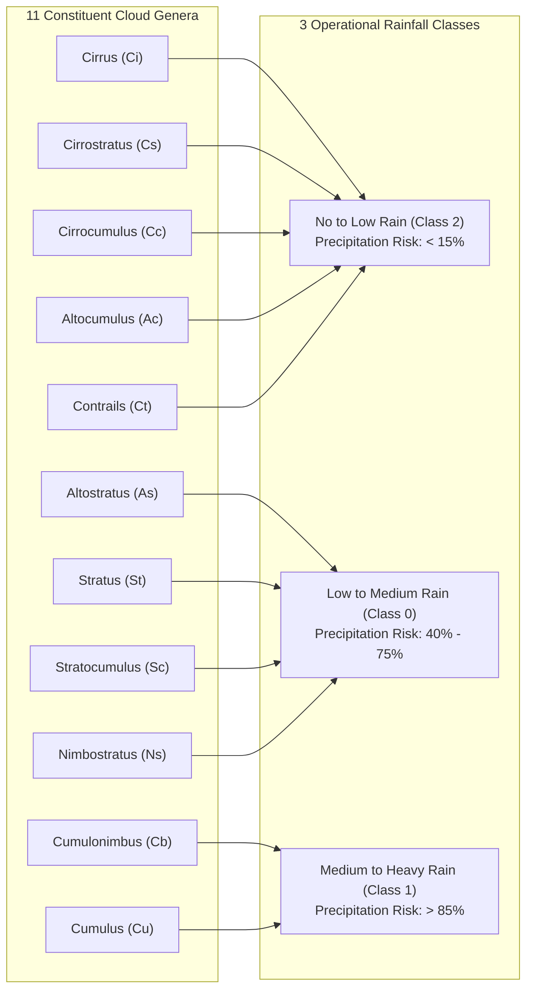

# SKYsense AI: Dataset Specification & Meteorological Partitioning

**Dataset Reference**: CCSN (Cirrus Cumulus Stratus Nimbus) Cloud Database  
**Source Provenance**: Kaggle Public Meteorological Dataset (`mmichelli/cirrus-cumulus-stratus-nimbus-ccsn-database`)  
**Aggregated Target Scale**: 2,543 Photographic Specimens across 3 Calibrated Rainfall Classes  

---

## 1. Dataset Overview

Ground-based cloud observation is an established branch of meteorological science codified by the World Meteorological Organization (WMO) in the *International Cloud Atlas*. The CCSN Database represents a standardized benchmark dataset containing natural photographic specimens captured by ground-based optical instruments across varying weather conditions, daylight angles, and geographical locations.

- **Total Photographic Records**: 2,543 verified images.
- **Native Format**: JPEG color photographs.
- **Native Spatial Resolutions**: $400 \times 400$ pixels up to high-definition photographic frames.
- **Constituent Cloud Classes**: 11 distinct cloud genera identified according to morphological altitude and structure.

---

## 2. Meteorological Aggregation & Rainfall Mapping

Raw cloud genera classification does not directly translate into precipitation forecast utility. For SKYsense AI, the 11 constituent cloud genera were mapped into three operational precipitation likelihood tiers based on atmospheric thermodynamic properties, cloud water path (CWP), and precipitation physics:



### Detailed Scientific Mapping Rationale

| Constituent Genera | WMO Code | Level / Altitude | Physical Description | Operational Class Mapping |
|---|---|---|---|---|
| **Cirrus** | `Ci` | High (> 6,000 m) | Detached, fibrous white ice-crystal filaments. | **`No_to_Low_Rain`** |
| **Cirrostratus** | `Cs` | High (> 6,000 m) | Transparent, whitish veil creating solar/lunar halos. | **`No_to_Low_Rain`** |
| **Cirrocumulus** | `Cc` | High (> 6,000 m) | Thin sheet of small white ripples ("mackerel sky"). | **`No_to_Low_Rain`** |
| **Altocumulus** | `Ac` | Middle (2,000 – 6,000 m) | White/grey patchy sheets with shaded elements. | **`No_to_Low_Rain`** |
| **Contrails** | `Ct` | High (Variable) | Artificial condensation trails from aircraft exhaust. | **`No_to_Low_Rain`** |
| **Altostratus** | `As` | Middle (2,000 – 6,000 m) | Fibrous greyish veil obscuring the sun; virga/light rain. | **`Low_to_Medium_Rain`** |
| **Stratus** | `St` | Low (0 – 2,000 m) | Uniform grey layer resembling elevated fog; light drizzle. | **`Low_to_Medium_Rain`** |
| **Stratocumulus** | `Sc` | Low (500 – 2,000 m) | Low, lumpy grey rolling patches; intermittent drizzle. | **`Low_to_Medium_Rain`** |
| **Nimbostratus** | `Ns` | Multi-level (Low/Mid) | Dark, thick amorphous rain-layer; continuous precipitation. | **`Low_to_Medium_Rain`** |
| **Cumulus** | `Cu` | Low-to-Mid (Vertical) | Dense, sharp outlines; towering cumulus precursors. | **`Medium_to_Heavy_Rain`** |
| **Cumulonimbus** | `Cb` | Severe Vertical (0 – 15,000 m) | Massive thunderstorm anvil; severe rain, hail, lightning. | **`Medium_to_Heavy_Rain`** |

---

## 3. Stratified Splitting & Partition Distribution

To prevent **data leakage** and ensure statistical validity, images are partitioned using a deterministic random seed (`seed = 42`) following a **70% / 15% / 15%** stratified split:

| Class Name | Raw Total Count | Train Split (70%) | Validation Split (15%) | Test Split (15%) |
|---|:---:|:---:|:---:|:---:|
| **`Low_to_Medium_Rain`** | 1,002 | 701 | 151 | 150 |
| **`Medium_to_Heavy_Rain`** | 621 | 435 | 93 | 93 |
| **`No_to_Low_Rain`** | 920 | 643 | 139 | 138 |
| **Total Specimens** | **2,543** | **1,779** | **383** | **381** |

### Split Verification Protocol:
1. **Disjoint Sets**: Verified via file SHA-256 hashes that zero image overlap exists between `train/`, `val/`, and `test/`.
2. **Held-Out Test Set**: The test split ($N = 381$) is never augmented and is held out entirely from parameter optimization.
3. **Reproducibility**: Run `python scripts/verify_dataset.py` to audit dataset integrity programmatically.

---

## 4. Curated Demonstration Images (`demo_images/`)

For oral project examinations and projector presentations without network latency or reliance on random sampling, a curated subset of **12 authentic photographic specimens** (4 per class) is pre-packaged in [demo_images/](file:///d:/personal/SkySense_AI/demo_images/):

```text
demo_images/
├── labels.json               # Structured ground truth metadata catalog
├── low_medium/
│   ├── As_As-N007.jpg        # Altostratus specimen (Low to Medium Rain)
│   ├── Ns_Ns-N009.jpg        # Nimbostratus specimen (Low to Medium Rain)
│   ├── St_St-N023.jpg        # Stratus specimen (Low to Medium Rain)
│   └── Sc_Sc-N003.jpg        # Stratocumulus specimen (Low to Medium Rain)
├── medium_heavy/
│   ├── Cb_Cb-N002.jpg        # Cumulonimbus specimen (Medium to Heavy Rain)
│   ├── Cu_Cu-N001.jpg        # Towering Cumulus specimen (Medium to Heavy Rain)
│   ├── Cb_Cb-N015.jpg        # Cumulonimbus anvil specimen (Medium to Heavy Rain)
│   └── Cb_Cb-N022.jpg        # Convective storm specimen (Medium to Heavy Rain)
└── no_low/
    ├── Ci_Ci-N010.jpg        # Cirrus fibratus specimen (No to Low Rain)
    ├── Cc_Cc-N005.jpg        # Cirrocumulus specimen (No to Low Rain)
    ├── Cs_Cs-N005.jpg        # Cirrostratus halo specimen (No to Low Rain)
    └── Ac_Ac-N008.jpg        # Altocumulus flock specimen (No to Low Rain)
```

- **Provenance**: Sampled directly from verified test partitions.
- **Ground Truth**: Cataloged in [demo_images/labels.json](file:///d:/personal/SkySense_AI/demo_images/labels.json).
- **Zero Fabrication**: All demonstration analyses execute the real deep learning model (`RainfallInferenceService`); no static predictions exist.

---

## 5. Dataset Operations & Maintenance Scripts

### Audit Dataset Structure:
```powershell
python scripts/verify_dataset.py
```
*Validates file counts, split ratios, channel integrity, and absence of data leakage.*

### Refresh Demonstration Specimens:
```powershell
python scripts/prepare_demo_data.py
```
*Copies 12 representative specimens from test splits into `demo_images/` and regenerates `labels.json`.*
