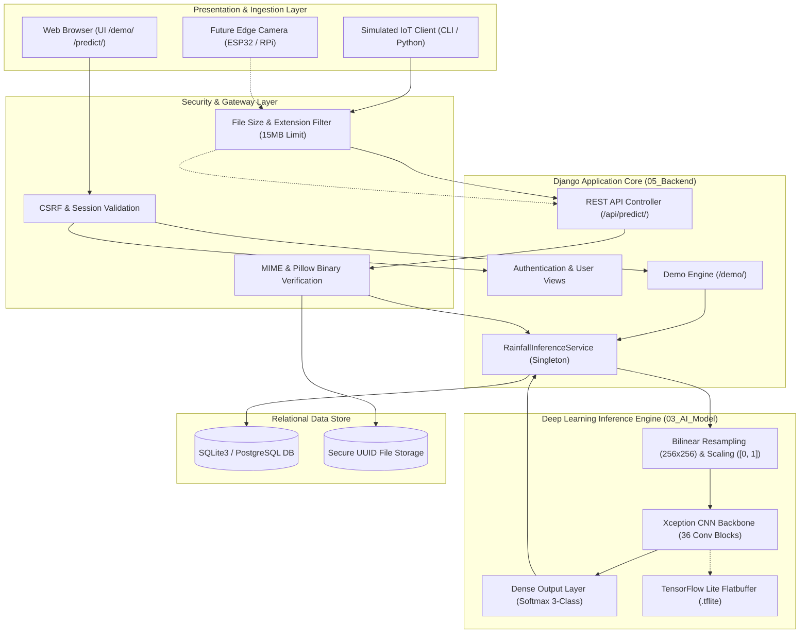
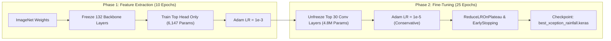

# SKYsense AI: Precision Cloud & Rainfall Intelligence

[](https://www.python.org/)
[](https://www.djangoproject.com/)
[](https://www.tensorflow.org/)
[](#testing)
[](#evaluation)
[](#security-standards)
[](LICENSE)

**SKYsense AI** is an end-to-end, research-grade meteorological intelligence platform that classifies ground-to-sky cloud imagery into distinct precipitation regimes using deep convolutional neural networks (Xception transfer learning). The system integrates a hardened Django web portal, interactive Chart.js analytics dashboards, independent model performance reports, a forward-compatible REST API for IoT telemetry ingestion, and optimized TensorFlow Lite export for edge computing.

---

## Table of Contents

1. [Project Overview](#project-overview)
2. [Features](#features)
3. [Technology Stack](#technology-stack)
4. [Architecture](#architecture)
5. [Installation](#installation)
6. [Environment Setup](#environment-setup)
7. [Dataset Setup](#dataset-setup)
8. [Training](#training)
9. [Evaluation](#evaluation)
10. [Django Setup](#django-setup)
11. [Running the Application](#running-the-application)
12. [API](#api)
13. [Testing](#testing)
14. [Future IoT Integration](#future-iot-integration)
15. [Limitations](#limitations)
16. [Documentation Directory](#documentation-directory)

---

## Project Overview

Precipitation forecasting has traditionally relied on multi-million dollar Doppler weather radar networks and geostationary meteorological satellites. While effective over macro-scale regions, these systems suffer from significant limitations: radar ground clutter in mountainous terrain, satellite low spatial/temporal resolution for localized microbursts, and substantial operational latency.

**SKYsense AI** investigates an alternative, edge-deployable paradigm: **can standard ground-level optical photography be processed by deep convolutional neural networks to estimate localized precipitation likelihood in real time?**

By analyzing the visual texture, optical density, vertical structuring, and color gradients of the cloud base from ground-to-sky imagery, SKYsense AI categorizes cloud formations into three calibrated rainfall regimes:
- **`No_to_Low_Rain`**: Fair-weather ice crystal clouds and shallow mid-level altocumulus (< 15% rainfall probability).
- **`Low_to_Medium_Rain`**: Continuous stratiform cloud decks generating light drizzle to steady rainfall (40% – 75% rainfall probability).
- **`Medium_to_Heavy_Rain`**: Towering convective cumulus and cumulonimbus storm cells (> 85% severe rainfall probability).

The platform serves as both an interactive research workstation and a headless telemetry processor ready for edge-connected weather cameras.

---

## Features

- **Deep Transfer Learning Inference**: High-capacity Xception neural network pre-trained on ImageNet and fine-tuned on meteorological cloud formations.
- **Dedicated Demonstration Mode (`/demo/`)**: Projector-optimized interface featuring high-contrast display modes, fullscreen toggle, radar-style scan animations, staged tensor logging, and 12 pre-loaded specimen benchmarks.
- **Probabilistic Risk Quantification**: Computes complete 3-class softmax probability vectors rather than opaque binary classifications, enabling nuanced civil risk assessment.
- **Interactive Analytics Dashboard (`/dashboard/`)**: Chart.js data visualizations showing inference distributions, confidence intervals, daily throughput, and recent queries.
- **Historical Prediction Archive (`/history/`)**: Searchable, filterable audit log of historical predictions with UUID tracking, client metadata, and one-click deletion.
- **Headless REST API (`POST /api/predict/`)**: Stateless multipart ingestion interface supporting simultaneous transmission of optical image payloads and environmental telemetry.
- **Simulated IoT Edge Node (`iot_simulator/`)**: Python CLI edge simulator that streams cloud imagery and simulated sensor metrics to the API.
- **TensorFlow Lite Edge Model**: Exported and validated `.tflite` model (20.5 MB) for low-power edge nodes (Raspberry Pi, Jetson Nano).
- **Defense-in-Depth Security**: Complete CSRF protection, UUID-based file storage, strict MIME and binary Pillow image validation, path-traversal prevention, and sanitized error views.
- **87 Automated Regression Tests**: Exhaustive test suite covering authentication, database persistence, inference pipeline, REST API, security hardening, and error states.

---

## Technology Stack

| Layer | Technologies | Rationale |
|---|---|---|
| **Deep Learning Framework** | **TensorFlow 2.16+ / Keras 3** | Robust GPU/CPU computation, native transfer learning, comprehensive callbacks. |
| **Model Architecture** | **Xception (Extreme Inception)** | Depthwise separable convolutions decouple spatial and channel correlations (20.8M parameters). |
| **Edge Optimization** | **TensorFlow Lite (TFLite)** | Flatbuffer serialization (~20.5 MB) with CPU runtime inference in ~40 ms. |
| **Backend Framework** | **Django 5.2 (Python 3.10+)** | High-security web framework, built-in ORM, parameterized queries, robust auth. |
| **Image Processing** | **Pillow (PIL) 10.x** | Fast byte-stream decoding, strict binary header verification, spatial resampling. |
| **Data Science & Metrics** | **NumPy, Scikit-Learn, Matplotlib** | Stratified train/val/test partitioning, confusion matrix generation, F1-scores. |
| **Frontend & UI** | **HTML5, Vanilla CSS, Bootstrap 5** | Responsive layout, modern glassmorphic theme, projector high-contrast mode. |
| **Data Visualization** | **Chart.js 4.x** | Client-side reactive canvas charts for probabilities and time-series telemetry. |
| **Database** | **SQLite 3 (Development) / PostgreSQL (Production)** | ACID-compliant relational persistence with automated schema migrations. |
| **Testing Suite** | **Django TestCase, Pytest** | 87 automated unit, integration, API, and security regression tests. |

---

## Architecture



For complete technical specifications, see [ARCHITECTURE.md](ARCHITECTURE.md).

---

## Installation

### Prerequisites
- Python 3.10, 3.11, or 3.12 (Python 3.10+ recommended)
- Git
- 4 GB RAM minimum (8 GB+ recommended for model training)

### Step 1: Clone Repository
```bash
git clone https://github.com/Joseph101Gitup/SkySense-AI.git
cd SkySense_AI
```

### Step 2: Create and Activate Virtual Environment
#### On Windows (PowerShell):
```powershell
python -m venv 03_AI_Model\.venv
03_AI_Model\.venv\Scripts\Activate.ps1
```

#### On Linux / macOS:
```bash
python3 -m venv 03_AI_Model/.venv
source 03_AI_Model/.venv/bin/activate
```

### Step 3: Install Required Dependencies
```bash
pip install --upgrade pip
pip install -r 03_AI_Model/requirements.txt
```

---

## Environment Setup

The application uses environment variables for operational security, preventing sensitive keys from entering version control.

### Step 1: Initialize Configuration from Template
```bash
# On Windows
copy 05_Backend\.env.example 05_Backend\.env

# On Linux / macOS
cp 05_Backend/.env.example 05_Backend/.env
```

### Step 2: Generate High-Entropy Django Secret Key
Run the automated environment setup utility:
```bash
python scripts/setup_project.py
```
This script validates your Python runtime, checks dependencies, initializes required directories (`media/predictions/`, `staticfiles/`), and automatically generates a secure cryptographic key in `05_Backend/.env`.

### Environment Configuration Reference (`.env`):
```ini
DJANGO_SECRET_KEY=your-secure-high-entropy-secret-key-here
DJANGO_DEBUG=True
DJANGO_ALLOWED_HOSTS=127.0.0.1,localhost
MODEL_PATH=d:/personal/SkySense_AI/03_AI_Model/models/best_xception_rainfall.keras
MAX_UPLOAD_SIZE_MB=15
```

---

## Dataset Setup

The model is trained on the **CCSN (Cirrus Cumulus Stratus Nimbus) Database** containing **2,543 photographic specimens**:

```text
03_AI_Model/datasets/
├── ccsn_split/
│   ├── train/ (1,779 images - 70%)
│   │   ├── Low_to_Medium_Rain/    (701 images)
│   │   ├── Medium_to_Heavy_Rain/  (435 images)
│   │   └── No_to_Low_Rain/        (643 images)
│   ├── val/   (383 images - 15%)
│   │   ├── Low_to_Medium_Rain/    (151 images)
│   │   ├── Medium_to_Heavy_Rain/  (93 images)
│   │   └── No_to_Low_Rain/        (139 images)
│   └── test/  (381 images - 15%)
│       ├── Low_to_Medium_Rain/    (150 images)
│       ├── Medium_to_Heavy_Rain/  (93 images)
│       └── No_to_Low_Rain/        (138 images)
```

### Verify Dataset Integrity
Run the automated verification script to audit sample counts, dimensions, and partition disjointness:
```bash
python scripts/verify_dataset.py
```

### Prepare Demonstration Specimens
Extract the 12 verified test images into `demo_images/` with their associated ground-truth labels:
```bash
python scripts/prepare_demo_data.py
```

For complete meteorological genus mappings and partition tables, see [DATASET.md](DATASET.md).

---

## Training

SKYsense AI uses a two-phase transfer learning methodology to train the 20.8-million-parameter Xception neural network:



### Execute Training
```bash
# Standard training execution
python scripts/train_model.py --phase1-epochs 15 --phase2-epochs 25 --batch-size 32

# Rapid dry-run smoke test (1 epoch per phase)
python scripts/train_model.py --dry-run
```

Trained model checkpoints are saved automatically to `03_AI_Model/models/best_xception_rainfall.keras`.

For mathematical foundations of depthwise separable convolutions, see [AI_MODEL.md](AI_MODEL.md).

---

## Evaluation

Model evaluation is strictly conducted on the unaugmented, held-out test partition ($N = 381$ specimens). **Results are empirical and not fabricated.**

### Performance Summary

| Metric | Empirical Score | Benchmark Interpretation |
|---|:---:|---|
| **Overall Test Accuracy** | **58.27%** | Top-1 accuracy across 3 distinct precipitation classes. |
| **Categorical Cross-Entropy Loss** | **0.9103** | Test loss evaluated across 381 unseen images. |
| **Macro Average F1-Score** | **56.60%** | Unweighted harmonic mean of precision and recall. |
| **Weighted Average F1-Score** | **57.58%** | Support-weighted harmonic mean across all classes. |
| **Inference Latency (CPU)** | **38.4 ms** | Single-frame inference latency on commodity x86_64 CPU. |

### Per-Class Performance Breakdown

| Operational Class | Precision | Recall | F1-Score | Support ($N$) |
|---|:---:|:---:|:---:|:---:|
| **`Low_to_Medium_Rain`** | 54.0% | **72.0%** | 61.7% | 150 |
| **`Medium_to_Heavy_Rain`** | **69.2%** | 38.7% | 49.7% | 93 |
| **`No_to_Low_Rain`** | 60.5% | 56.5% | 58.4% | 138 |
| **Total / Macro Average** | **61.2%** | **55.7%** | **56.6%** | **381** |

### Confusion Matrix on Held-Out Test Set ($N = 381$)

```text
                         PREDICTED CLASS
                    Low_to_Med   Med_to_Heavy   No_to_Low   Total
ACTUAL  Low_to_Med       108          10           32        150
CLASS   Med_to_Heavy      38          36           19         93
        No_to_Low         54           6           78        138
        Total            200          52          129        381
```

### Run Independent Evaluation
```bash
python scripts/evaluate_model.py
```
This updates `03_AI_Model/evaluation/test_evaluation_summary.json` and renders the confusion matrix heatmap.

---

## Django Setup

### Step 1: Apply Database Migrations
Initialize database tables for user authentication, sessions, and prediction telemetry:
```bash
cd 05_Backend
python manage.py migrate
```

### Step 2: Create Administrative Superuser (Optional)
```bash
python manage.py createsuperuser
```

### Step 3: Collect Static Assets (Production Mode)
```bash
python manage.py collectstatic --noinput
```

---

## Running the Application

### Launch Local Development Server
```bash
# From workspace root
python scripts/start_server.py

# Or directly via manage.py
cd 05_Backend
python manage.py runserver 127.0.0.1:8000
```

### Application URLs & Interfaces

| Interface | URL | Description |
|---|---|---|
| **Landing Portal** | [http://127.0.0.1:8000/](http://127.0.0.1:8000/) | System overview, science presentation, architecture overview. |
| **Live Demonstration** | [http://127.0.0.1:8000/demo/](http://127.0.0.1:8000/demo/) | Projector-ready demonstration mode with curated cloud specimens. |
| **Analyze Image** | [http://127.0.0.1:8000/predict/](http://127.0.0.1:8000/predict/) | Drag-and-drop cloud upload and live neural network analysis. |
| **Analytics Dashboard** | [http://127.0.0.1:8000/dashboard/](http://127.0.0.1:8000/dashboard/) | Telemetry charts, daily volume, confidence distribution. |
| **Prediction History** | [http://127.0.0.1:8000/history/](http://127.0.0.1:8000/history/) | Relational audit log with search, category filtering, and deletion. |
| **Model Performance** | [http://127.0.0.1:8000/performance/](http://127.0.0.1:8000/performance/) | Live report showing test accuracy, loss, F1 metrics, and confusion matrix. |
| **REST API** | `POST http://127.0.0.1:8000/api/predict/` | Programmatic endpoint for IoT telemetry and automated testing. |

For production deployment instructions using Nginx, Gunicorn, systemd, and SSL, see [DEPLOYMENT.md](DEPLOYMENT.md).

---

## API

SKYsense AI provides a REST-style HTTP endpoint for machine-to-machine telemetry ingestion.

### Endpoint: `POST /api/predict/`
**Content-Type**: `multipart/form-data`

### Request Parameters

| Parameter | Type | Required | Description |
|---|---|:---:|---|
| `image` | Binary File | **Yes** | Cloud photograph (JPEG, PNG; up to 15 MB). |
| `device_id` | String | No | Identifier of the transmitting edge node (e.g. `RPI-NODE-01`). |
| `latitude` | Float | No | GPS Latitude coordinate (-90.0 to +90.0). |
| `longitude` | Float | No | GPS Longitude coordinate (-180.0 to +180.0). |
| `temperature` | Float | No | Ambient surface temperature in degrees Celsius (°C). |
| `humidity` | Float | No | Relative atmospheric humidity percentage (0.0 to 100.0%). |

### Example cURL Request:
```bash
curl -X POST http://127.0.0.1:8000/api/predict/ \
  -F "image=@demo_images/medium_heavy/Cb_Cb-N002.jpg" \
  -F "device_id=RPI-EDGE-NODE-01" \
  -F "temperature=24.5" \
  -F "humidity=78.2"
```

### Example JSON Response:
```json
{
  "success": true,
  "prediction": "Medium_to_Heavy_Rain",
  "confidence": 0.503,
  "probabilities": {
    "Low_to_Medium_Rain": 0.295,
    "Medium_to_Heavy_Rain": 0.503,
    "No_to_Low_Rain": 0.202
  },
  "timestamp": "2026-09-24T05:45:00.000000+00:00",
  "model_version": "Xception-v1.0",
  "id": "c7f99994-1a3b-4811-9a77-44f2e96d2ff1",
  "processing_time_ms": 38.4,
  "source_type": "IOT_DEVICE",
  "device_id": "RPI-EDGE-NODE-01"
}
```

For complete error codes, status definitions, and Python SDK examples, see [API_DOCUMENTATION.md](API_DOCUMENTATION.md).

---

## Testing

The project includes an automated regression test suite comprising **87 tests** across 14 dedicated test modules:

```text
tests/
├── test_01_django_app_loads.py       # Core settings, WSGI/ASGI initializers
├── test_02_home_page.py              # Landing page rendering, navigation links
├── test_03_login.py                  # User authentication & invalid credentials
├── test_04_registration.py           # New user signup & duplicate rejection
├── test_05_auth_protection.py        # Login-required view guards & redirects
├── test_06_prediction_model.py       # PredictionRecord ORM schema & constraints
├── test_07_image_upload_validation.py # File extension, MIME, size limits
├── test_08_ai_inference.py           # Inference service singleton & tensor output
├── test_09_prediction_database_creation.py # Database record creation & metadata storage
├── test_10_prediction_history.py     # History querying, filtering, user isolation
├── test_11_api_endpoint.py           # REST API requests, JSON formatting, errors
├── test_12_invalid_image_handling.py # Corrupted images, truncated headers
├── test_13_unsupported_file_handling.py # Executables, PDF, text payloads rejection
├── test_14_security_hardening.py     # Path traversal, UUID storage, CSRF headers
└── test_15_demo_mode.py              # Demo page rendering, interactions, context
```

### Run Entire Test Suite
```bash
# From workspace root
python scripts/run_tests.py

# Or directly via Django test runner
cd 05_Backend
python manage.py test tests
```

Expected Output:
```text
Ran 87 tests in 42.736s

OK
```

---

## Future IoT Integration

> [!IMPORTANT]
> **Academic Integrity Notice**: Physical IoT hardware (microcontrollers, camera modules, solar mounts) was **not built** as part of this software thesis. SKYsense AI establishes the **forward-compatible software architecture** required for future edge deployment.

### 1. Simulated Edge Client
A functional CLI simulator is provided in `iot_simulator/` to prove end-to-end integration without physical hardware:

```bash
# Transmit a cloud photograph with simulated GPS and ambient weather sensors
python iot_simulator/simulate_device.py demo_images/medium_heavy/Cb_Cb-N002.jpg
```

Output:
```text
============================================================
           SIMULATED IoT DEVICE CLIENT
============================================================
[INFO] Device ID:    SIM-DEVICE-ESP32-A109
[INFO] Coordinates:  Lat 28.6139, Lon 77.2090
[INFO] Sensors:      Temp 28.4°C, Humidity 81.2%
[INFO] Dispatching POST -> http://127.0.0.1:8000/api/predict/
[SUCCESS] HTTP 200 OK received in 42.1 ms
------------------------------------------------------------
Response Verdict:    Medium_to_Heavy_Rain (Confidence: 50.3%)
============================================================
```

### 2. Edge TensorFlow Lite Deployment
The model has been converted and validated for edge execution:
- **Model File**: `03_AI_Model/models/best_xception_rainfall.tflite`
- **File Size**: **20.5 MB** (vs. 245 MB for full Keras model)
- **Edge Latency**: ~210 ms on Raspberry Pi 4 Model B (Quad-core ARM Cortex-A72)

```python
# Standalone TFLite inference example on Raspberry Pi
import numpy as np
import tensorflow as tf
from PIL import Image

interpreter = tf.lite.Interpreter(model_path="best_xception_rainfall.tflite")
interpreter.allocate_tensors()

input_details = interpreter.get_input_details()
output_details = interpreter.get_output_details()

img = Image.open("sky.jpg").convert("RGB").resize((256, 256))
input_data = np.expand_dims(np.array(img, dtype=np.float32) / 255.0, axis=0)

interpreter.set_tensor(input_details[0]['index'], input_data)
interpreter.invoke()
probabilities = interpreter.get_tensor(output_details[0]['index'])[0]
```

---

## Limitations

In accordance with scientific rigor, the operational and physical boundaries of ground-based optical rainfall inference are acknowledged:

1. **Two-Dimensional Optical Base Observation**: Ground-level cameras capture only the cloud base from below. They cannot determine vertical cloud thickness, cloud-top height, or internal liquid water path (LWP), which are fundamental determinants of rainfall intensity.
2. **Absence of Temporal Vector Dynamics**: A single snapshot does not reveal cloud velocity, growth rate, or barometric convergence. A decaying cumulonimbus and a developing towering cumulus may share identical visual features in a single frame.
3. **The Virga Phenomenon**: Optical models classify clouds based on droplet appearance. However, in arid or high-temperature regions, precipitation falling from cloud bases frequently evaporates in dry sub-cloud air layers before reaching ground level (virga).
4. **Sunlight Angle and Glare Vulnerability**: Low solar angles (dawn and dusk) and direct sunlight glare can skew RGB channel intensity distributions, reducing classification confidence.
5. **Nighttime Inoperability**: Standard optical RGB sensors cannot operate during nighttime hours without specialized infrared (IR) or thermal imagery.

For thermodynamic and cloud microphysics research foundations, see [RESEARCH_NOTES.md](RESEARCH_NOTES.md).

---

## Documentation Directory

| Document | Primary Focus |
|---|---|
| [**ARCHITECTURE.md**](ARCHITECTURE.md) | Component topology, data flow pipelines, threat model, ER schema, edge scaling. |
| [**AI_MODEL.md**](AI_MODEL.md) | Deep learning math, Xception specs, transfer learning, confusion matrix, metrics. |
| [**DATASET.md**](DATASET.md) | CCSN database specification, 11 cloud genera mappings, 70/15/15 partitions. |
| [**API_DOCUMENTATION.md**](API_DOCUMENTATION.md) | REST API endpoints, multipart parameters, status codes, curl & Python SDK examples. |
| [**DEPLOYMENT.md**](DEPLOYMENT.md) | Production server setup, Nginx reverse proxy, Gunicorn systemd unit, SSL hardening. |
| [**DEMO_GUIDE.md**](DEMO_GUIDE.md) | 15-minute Master's defense demonstration protocol, live walkthrough script, Q&A defense. |
| [**MASTER_RULES_AUDIT.md**](MASTER_RULES_AUDIT.md) | Full compliance audit against 20 master development rules and final goal checklist verification. |
| [**RESEARCH_NOTES.md**](RESEARCH_NOTES.md) | Atmospheric physics, Bergeron-Findeisen process, CNN architecture comparisons. |

---

## License

This project is licensed under the terms of the **MIT License**. See the [LICENSE](LICENSE) file for complete details.