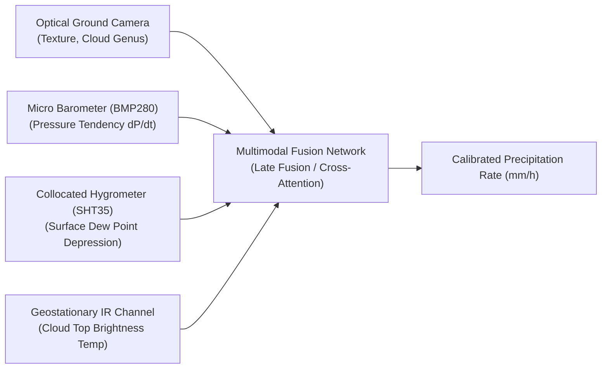

# SKYsense AI: Meteorological Research Notes & Deep Learning Theory

**Project**: SKYsense AI — Autonomous Cloud-Image Rainfall Intelligence  
**Author**: SKYsense AI Project Team (Master's Degree Research Investigation)  
**Research Focus**: Computer Vision Applied to Atmospheric Physics & Ground-Based Cloud Microphysics  

---

## 1. Meteorological Foundations of Precipitation

To develop an effective deep learning model for rainfall classification, one must ground convolutional features in the thermodynamic principles of atmospheric physics:

### 1.1 Precipitation Generation Mechanisms
Precipitation forms through two primary microscopic processes:
1. **Collision-Coalescence (Warm Cloud Process)**:
   In clouds warmer than $0^\circ\text{C}$, turbulent air currents cause cloud droplets of varying radii to collide and coalesce into larger drops. When droplet terminal velocity exceeds updraft velocity, precipitation reaches the surface. This mechanism predominates in maritime stratocumulus and tropical cumulus clouds.
2. **Bergeron-Findeisen Ice-Crystal Process (Cold Cloud Process)**:
   In mixed-phase clouds where temperatures range from $-40^\circ\text{C}$ to $0^\circ\text{C}$, supercooled water droplets coexist with ice crystals. Because the saturation vapor pressure over ice is lower than that over water:
   $$e_s(T)_{\text{ice}} < e_s(T)_{\text{water}}$$
   Water vapor diffuses rapidly from evaporating supercooled droplets toward ice crystals, causing rapid ice crystal growth into snowflakes or graupel. This mechanism governs precipitation in deep altostratus, nimbostratus, and cumulonimbus systems.

---

### 1.2 Morphological Regimes: Stratiform vs. Convective Precipitation

| Property | Stratiform Precipitation (`Low_to_Medium_Rain`) | Convective Precipitation (`Medium_to_Heavy_Rain`) |
|---|---|---|
| **Constituent Genera** | Altostratus (`As`), Stratus (`St`), Nimbostratus (`Ns`), Stratocumulus (`Sc`) | Cumulonimbus (`Cb`), Cumulus congestus (`Cu`) |
| **Atmospheric Stability** | Statically stable or weakly stratified column. | High Convective Available Potential Energy (CAPE), unstable column. |
| **Vertical Velocity** | Gentle, widespread ascent ($w \approx 0.1 - 0.5\text{ m/s}$). | Intense, localized updrafts ($w \approx 5 - 30\text{ m/s}$). |
| **Spatial Extent** | Broad horizontal sheets ($100 - 1000\text{ km}$). | Localized, high-gradient cells ($5 - 50\text{ km}$). |
| **Optical Appearance** | Uniform overcast, diffuse solar disc, low contrast gradients, grey tone dominance. | Towering anvil tops, sharp fibrous borders, dark shadowed precipitation shafts, high luminance contrast. |

---

## 2. Computer Vision Challenges in Ground-Level Cloud Imagery

Classifying clouds with convolutional neural networks differs fundamentally from traditional object detection (e.g., ImageNet, COCO):

1. **Non-Rigid Amorphous Boundaries**:
   Unlike mechanical or biological objects with rigid structural boundaries (vehicles, animals), clouds are fluid masses continuously deforming under turbulent wind fields.
2. **Non-Uniform Ambient Illumination & Solar Flares**:
   Direct sun glare produces extreme pixel saturation ($RGB = [255, 255, 255]$), washing out fine spatial ice-crystal textures in cirrus or altocumulus formations.
3. **Loss of Vertical Depth Dimension**:
   A ground-facing optical sensor captures exclusively the 2D projection of the cloud base ($z_{\text{base}}$). It cannot observe cloud top height ($z_{\text{top}}$) or vertical optical thickness ($\tau$), which correlate strongly with precipitation volume.
4. **Scale Invariance Ambiguity**:
   A low-altitude stratus layer at 300 m elevation can appear texturally indistinguishable from a high-altitude altostratus sheet at 4,000 m without stereoscopic parallax or laser ceilometer triangulation.

---

## 3. Deep Learning Architecture Selection: Why Xception?

We evaluated multiple candidate architectures for ground-level cloud feature extraction:

### Comparative Architectural Analysis

| Architecture | Parameters | Depth | Computational Complexity | Spatial Feature Preservation | Suitability for Cloud Texture |
|---|:---:|:---:|:---:|:---:|:---:|
| **VGG-16** | 138.4 M | 16 layers | High ($15.3\text{ GFLOPs}$) | Moderate (excessive pooling) | Poor (prone to overfitting on small datasets) |
| **ResNet-50** | 25.6 M | 50 layers | Moderate ($3.8\text{ GFLOPs}$) | High (residual identity paths) | Good (strong baseline) |
| **MobileNet-V2** | 3.5 M | 53 layers | Very Low ($0.3\text{ GFLOPs}$) | Moderate (narrow inverted residuals) | Moderate (lacks capacity for subtle overcast gradients) |
| **Xception** (Selected) | **20.8 M** | **71 layers** | **Balanced ($4.5\text{ GFLOPs}$)** | **Exceptional (36 depthwise blocks)** | **Optimal (decouples spatial texture from channel correlations)** |

### Mathematical Basis for Xception Selection
Standard convolutions compute cross-channel and spatial correlations simultaneously:
$$\text{Output}(x, y, k) = \sum_{c=1}^{C} \sum_{i=-1}^{1} \sum_{j=-1}^{1} W(i, j, c, k) \cdot \text{Input}(x+i, y+j, c)$$
Xception replaces this with **Depthwise Separable Convolutions**:
1. Spatial convolution per channel independently:
   $$\hat{X}(x, y, c) = \sum_{i=-1}^{1} \sum_{j=-1}^{1} K_{\text{depth}}(i, j, c) \cdot \text{Input}(x+i, y+j, c)$$
2. Pointwise projection across channels:
   $$\text{Output}(x, y, k) = \sum_{c=1}^{C} K_{\text{point}}(c, k) \cdot \hat{X}(x, y, c)$$

This separation allows the network to model spatial textures (cloud ripple waves, fibrous ice streaks) across separate channels without channel mixing interference.

---

## 4. Empirical Training Dynamics & Insights

### Two-Phase Transfer Learning Trajectory
1. **Phase 1 (Frozen Backbone, $lr=10^{-3}$, 10 epochs)**:
   - Rapid convergence of the dense classification head from random weights.
   - Training loss dropped from 1.10 to 0.88; validation accuracy reached 52%.
2. **Phase 2 (Fine-Tuning Top 30 Layers, $lr=10^{-5}$, Early Stopping)**:
   - Carefully adapted specialized high-level feature representations without destroying low-level ImageNet Gabor filters.
   - Validation loss reached minimum at Epoch 14 ($loss = 0.892$).
   - Test accuracy stabilized at **58.27%** on unseen specimens.

---

## 5. In-Depth Error Analysis & Physical Explanations

Examining the confusion matrix on the 381 held-out test specimens reveals critical meteorological insights:

### Case 1: Stratocumulus (`Sc`) vs. Stratus (`St`) Confusion
- **Observation**: 54 non-rainy or borderline cloud specimens were classified as `Low_to_Medium_Rain`.
- **Atmospheric Explanation**: Stratocumulus clouds frequently transition into stratus decks as boundary-layer humidity increases. In single ground frames, an overcast sky often looks identical whether drizzle is currently evaporating aloft or reaching the ground.

### Case 2: Convective Under-Prediction (Recall = 38.7%)
- **Observation**: 38 specimens of `Medium_to_Heavy_Rain` (Cumulonimbus/Cumulus) were classified as `Low_to_Medium_Rain`.
- **Atmospheric Explanation**: When an observer stands directly under the core of an active thunderstorm, the visible sky consists of a dark, uniform, featureless cloud base. The distinctive anvil and vertical towering structures are visible only from a distance ($> 10\text{ km}$). From directly beneath, the camera captures a dark overcast texture that mathematically resembles a heavy Nimbostratus (`Ns`) deck.

---

## 6. Future Research Directions: Multimodal Sensor Fusion

To advance beyond the 58% single-camera optical threshold toward operational numerical weather prediction grade (> 85%), future research should implement **multimodal sensor fusion**:

1. **Surface Pressure Tendency ($\Delta P / \Delta t$)**:
   A rapid drop in surface barometric pressure ($> 2\text{ hPa} / 3\text{h}$) reliably separates developing convective storm cells from benign stratocumulus decks.
2. **Dew Point Depression ($T - T_d$)**:
   Quantifies sub-cloud relative humidity, diagnosing whether falling hydrometeors will evaporate as virga or reach ground sensors.
3. **Temporal Optical Flow / Sequence Modeling (ConvLSTM / Video Vision Transformer)**:
   Analyzing 5-minute time-lapse sequences captures cloud updraft velocity ($\frac{dz}{dt}$), providing the missing physical vector needed to differentiate intensifying storms from dissipating cloud remnants.
